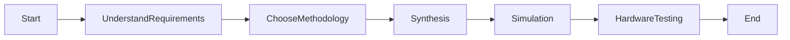

# `Clock Domain Crossing with Asynchronous Interfaces`

## **Problem Statement**

This project explores a challenging aspect of clock domain crossing: crossing data between clock domains with asynchronous interfaces. Asynchronous interfaces are common in high-performance systems, such as those used in networking and embedded systems. However, they can be difficult to synchronize with FPGAs, which typically operate with synchronous clocks.

This project would involve designing and implementing RTL solutions for handling data transfer and synchronization in scenarios with asynchronous interfaces. This could include using techniques such as handshaking, FIFOs, and synchronizers.

## **Approach**

- **`Identify the different clock domains and asynchronous interfaces in the system.`**

    - The first step is to identify all of the different clock domains and asynchronous interfaces in the system. This will help you to understand the challenges that you need to address.

- **`Choose the appropriate CDC techniques.`** 

    - There are a number of different CDC techniques that can be used to cross data between clock domains. The best technique to use will depend on the specific requirements of your system. For example, if you need to transfer data between two clock domains with asynchronous interfaces, you may want to use a FIFO or a synchronizer.

- **`Design and implement the RTL solutions.`** 

    - Once you have chosen the appropriate CDC techniques, you need to design and implement the RTL solutions. This will involve writing the HDL code for the CDC logic and integrating it into the rest of your system.

- **`Test and verify the CDC logic.`**

    - It is important to thoroughly test and verify the CDC logic to ensure that it is working correctly. This can be done using simulation and/or hardware testing.

## **Examples of RTL solutions to implement in this project:**

- **`FIFO-based CDC:`** 

  - A FIFO-based CDC solution uses a FIFO to buffer data between the two clock domains. This allows the data to be transferred asynchronously between the two clock domains, and it also helps to protect the data from meta-stability.

- **`Synchronizer-based CDC:`**

  - A synchronizer-based CDC solution uses a synchronizer to synchronize the data between the two clock domains. This is a simpler solution than a FIFO-based CDC solution, but it is not as robust.

- **`Handshaking-based CDC:`**

  - A handshaking-based CDC solution uses a handshaking protocol to synchronize the data between the two clock domains. This is a more complex solution than a synchronizer-based CDC solution, but it is also the most robust.

## **FIFO based CDC**

A FIFO-based CDC solution uses a FIFO to buffer data between the two clock domains. A FIFO is a first-in-first-out memory buffer. Data is written to the FIFO from the source clock domain, and data is read from the FIFO from the destination clock domain.

The FIFO allows the data to be transferred asynchronously between the two clock domains. The source clock domain can write data to the FIFO at any time, and the destination clock domain can read data from the FIFO at any time.

The FIFO also helps to protect the data from meta-stability. Meta-stability is a condition where a signal does not settle to a valid voltage level within the required setup and hold times of a flip-flop. This can cause the flip-flop to capture an incorrect value.

By buffering the data in the FIFO, the FIFO-based CDC solution ensures that the data is stable before it is read by the destination clock domain.

## **Synchronizer-based CDC**

A synchronizer-based CDC solution uses a synchronizer to synchronize the data between the two clock domains. A synchronizer is a circuit that uses two flip-flops to capture the data from the source clock domain and transfer it to the destination clock domain.

The synchronizer works by capturing the data from the source clock domain on one clock edge and then transferring it to the destination clock domain on the next clock edge. This ensures that the data is stable before it is read by the destination clock domain.

However, synchronizer-based CDC solutions are not as robust as FIFO-based CDC solutions. This is because synchronizer-based CDC solutions are susceptible to meta-stability. If the data from the source clock domain does not settle to a valid voltage level within the required setup and hold times of the flip-flops in the synchronizer, the synchronizer may capture an incorrect value.

## **Handshaking-based CDC**

A handshaking-based CDC solution uses a handshaking protocol to synchronize the data between the two clock domains. A handshaking protocol is a communication protocol that allows two parties to communicate with each other in an asynchronous manner.

The handshaking protocol works by using two signals: a request signal and an acknowledge signal. The source clock domain sends the request signal to the destination clock domain when it has data to transfer. The destination clock domain sends the acknowledge signal to the source clock domain when it is ready to receive data.

The handshaking protocol ensures that the data is stable before it is transferred between the two clock domains. This is because the source clock domain will not send the data until the destination clock domain has sent the acknowledge signal.

However, handshaking-based CDC solutions are more complex than the other two CDC techniques. This is because the handshaking protocol requires additional logic to be implemented.

## **Advantages and Disadvantages**

**`1. FIFO-based CDC`**

| **`Advantages`**           | **`Disadvantages`**                 |
|--------------------------|----------------------------------|
| Robust to meta-stability | Complex to design and implement   |
| High throughput          | Requires additional hardware     |
| Low latency              |                                  |

**`2. Handshaking-based CDC`**

| **`Advantages`**           | **`Disadvantages`**                 |
|--------------------------|----------------------------------|
| Simple to design and implement | Susceptible to meta-stability  |
| Does not require additional hardware | Lower throughput than FIFO-based CDC |
|                          | Higher latency than FIFO-based CDC |

## **Factors while choosing CDC techniques:**

- **`Data throughput requirements:`** If your application requires high data throughput, then a FIFO-based CDC solution is the best choice.

- **`Latency requirements:`** If your application requires low latency, then a FIFO-based CDC solution is the best choice.

- **`Reliability requirements:`** If your application requires high reliability, then a handshaking-based CDC solution is not a good choice due to its susceptibility to meta-stability.

- **`Cost:`** FIFO-based CDC solutions are more expensive than handshaking-based CDC solutions due to the additional hardware resources required.

## **CDC Methodologies**

There are a number of different clock domain crossing (CDC) methodologies available. Some of the most common CDC methodologies include:

- **`Asynchronous design methodology (ADM):`** ADM is a methodology for designing circuits that can operate asynchronously. This means that the circuits in the different clock domains do not need to be synchronized with each other. ADM is a complex methodology, but it can be used to design very high-performance circuits.

- **`Synchronous design methodology (SDM):`** SDM is a methodology for designing circuits that are synchronized with a common clock. This is the most common CDC methodology, and it is the simplest CDC methodology to implement. However, SDM can lead to lower performance and higher latency than ADM.

- **`Gray code synchronization:`** Gray code synchronization is a technique for synchronizing data between two clock domains. This technique uses Gray code, which is a binary coding scheme that has the property that only one bit changes at a time when the code changes. Gray code synchronization is a simple technique to implement, but it is not as robust as other CDC techniques.

- **`Dual-clock FIFO:`** A dual-clock FIFO is a type of FIFO that can be used to cross data between two clock domains. The dual-clock FIFO has two clock ports, one for each clock domain. This allows the data to be written to the FIFO from one clock domain and read from the FIFO from the other clock domain. Dual-clock FIFOs are a robust and efficient way to cross data between two clock domains.

## **Project Flow**

- Start by understanding the requirements of your application. What are the throughput requirements? What are the latency requirements? What are the reliability requirements? Once you understand the requirements of your application, you can choose the appropriate CDC methodology and techniques.

- Choose a methodology between a number of different CDC design methodologies available. 

- Use a synthesis tool that supports CDC. A synthesis tool that supports CDC can help to avoid common CDC design errors.

- Use a simulation tool to verify CDC design. A simulation tool can help to identify and correct CDC design errors.

- Use a hardware testing tool to verify CDC design. A hardware testing tool can help to verify that CDC design is working correctly in real hardware.

